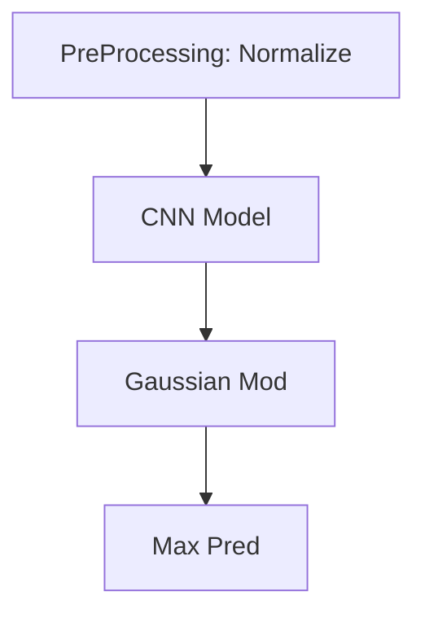
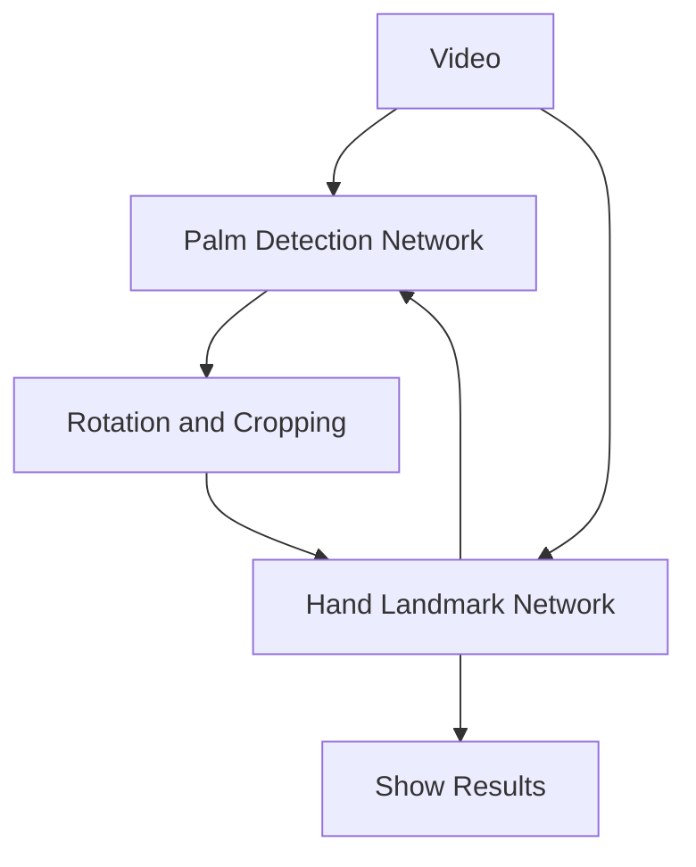
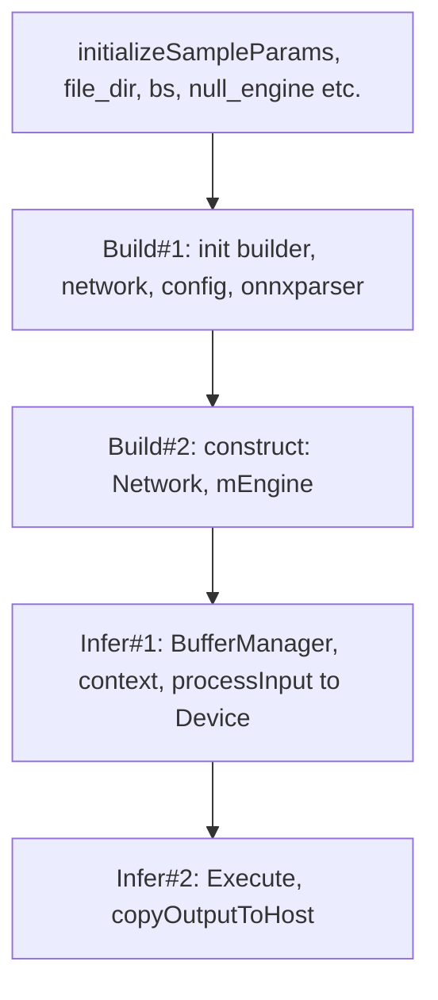

## Todo

- [x] Preprocessing

- [x] DNN Deployment
    - [x] LibTorch
    - [x] OpenVINO
    - [x] TVM
    - [x] ONNX
    
    | Engine   | Time/ms, BS=2 |
    | -------- | ------------- |
    | LibTorch | 320           |
    | OpenVINO | 150           |
    | TVM      | 600           |
    | ONNX RT  | 300           |
    
- [ ] Pipelined Processing
    - [ ] Multi-threading
    - [ ] IPC method
    
- [x] Post Processing


Pose Pipe:



Palm Detection

````mermaid
graph TD
A[PreProc: Normalize]-->B[NN Model]-->C{raw box}
B-->D{raw score}
C-->E[decode box]
D-->F[sigmoid]
E-->G[masking]
F-->G
G-->H[weighted_NMS]
````

Hand 



TensorRT workflow



| | Has (recent)c++ prebuilts | C++ buildable | Handle PreBuilt Models | HW Acceleration |
| ------------------------- | ------------- | ---------------------- | --------------- | ---- |
| MXNET                     | NO            | Not So Far             | Yes | Fastest Cuda impl |
| TensorFlow | NO | Not since change to bazel | The pgm is the model | Slower |
| CNTK |  |  |  |  |
| caffe2 | Yes | Yes | Yes lots of them | yes |
| libtorch | Yes | Yes | Only TorchScript | Yes |
| OpenVino | Yes | Yes | Yes lots | Yes, Intel only |
