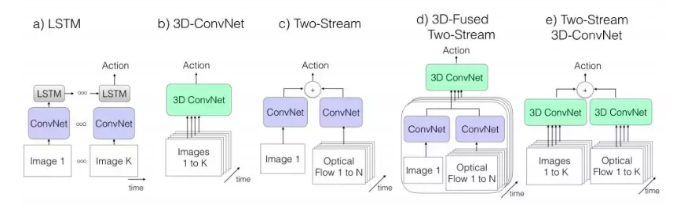

# Acceleration in Modern Video Processing 

## Tasks and Algorithms

* Motion Classification [3,4]

  * 单流网络，使用预训练的二维卷积网络从连续帧中融合时间信息。

    * 与现有的基于人工特征的算法相比，结果明显更差。原因有很多：
      * 学习的时空特征没有捕捉运动特征
      * 数据集多样化相对较少，学习这种详细特征比较困难。

  * 双流网络。框架有 2 个单独的网络：空间上下文+运动上下文

    * 通过明显捕捉局部时间运动提升了单流方法的性能，但仍然存在一些缺点：
      * 平均采样预测剪辑，在学习的特征中长期的时间信息仍然是丢失的。
      * 存在错误标签分配问题
      * 预计算光流向量

  * Models:

    * LRCN, C3D, Conv3D & Attention, TwoStreamFusion, TSN, ActionVlad, HiddenTwoStream, I3D, T3D

      

    * Sota for video activity detection 2019: SlowFast Networks [7]

* Object Detection

  * 

* Object Tracking/ Estimation: 
  * Face
  * Pose
  
* Segmentation

* Smart City

* Super Resolution

* Video Tagging for Recommendation

* Style Transfer

## Platform and Implementation

### Model Deployment

* TF Lite
* LibTorch
* ONNX
* TensorRT
* OpenVINO
* TVM

### Video Pipeline

* MediaPipe
* GStreamer
* DFF video detection (*sota*)

### Hardware Accelerator

* GPU
* CPU
* Accelerator:
  * Huawei ascend?
  * Yitu questcore?
  * Ali
  * ...

## Reference

1. [深度学习框架之视频处理应用](https://www.jianshu.com/p/6e0bdd1fd917)
2. [深度学习在视频分析中的架构、算法及应用](https://blog.csdn.net/vn9PLgZvnPs1522s82g/article/details/79314763)
3. [Large-scale Video Classification with Convolutional Neural Networks](https://cs.stanford.edu/people/karpathy/deepvideo/), CVPR 2014
4. [一文看懂如何将深度学习应用于视频动作识别](https://juejin.im/post/5b4c3bb65188251b3c3b1bbb)
5. [Christoph Feichtenhofer](https://feichtenhofer.github.io/)
6. [光流估计——从传统方法到深度学习](https://zhuanlan.zhihu.com/p/74460341)
7. [SlowFast Networks for Video Recognition](https://ai.facebook.com/blog/slowfast-video-recognition-through-dual-frame-rate-analysis/)
8. [Deep-Feature-Flow](https://github.com/msracver/Deep-Feature-Flow), CVPR 2017