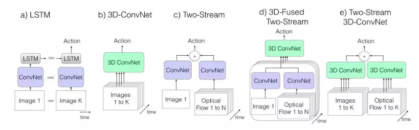

# 视频处理优化

## 视频处理任务与模型

* Object Detection  [link1](https://www.jianshu.com/p/b12be9079e52), [link2](https://blog.csdn.net/lilai619/article/details/85757503)

  * RCNN系列

    * R-CNN
    * Fast R-CNN
    * Faster R-CNN
    * Mask R-CNN

  * SSD (Single Shot MultiBox Defender)

  * YOLO系列 [v1](https://zhuanlan.zhihu.com/p/46691043), [v2](https://zhuanlan.zhihu.com/p/47575929), [v3](https://zhuanlan.zhihu.com/p/49556105)

  * Video Related [link1](https://github.com/guanfuchen/video_obj), [link2](https://github.com/jiangzhengkai/Video-Detection)

    * MSRA: [DFF](https://arxiv.org/abs/1611.07715), [FGFA](), [HPVOD](https://arxiv.org/abs/1804.05830)

      

    * SenseTime: ST-Lattice

      

* Object Estimation

  * Face [link](https://zhuanlan.zhihu.com/p/42968117)
  * Pose [link](https://zhuanlan.zhihu.com/p/85506259)
  * Hand 

* Action/Motion Classification [link1](https://juejin.im/post/5b4c3bb65188251b3c3b1bbb), [link2](https://feichtenhofer.github.io/)

  

  * LRCN, C3D, Conv3D & Attention, TwoStreamFusion, TSN, ActionVlad, HiddenTwoStream, I3D, T3D, ...
  * Sota for video activity detection 2019: [SlowFast Networks ](https://ai.facebook.com/blog/slowfast-video-recognition-through-dual-frame-rate-analysis/)

* Segmentation

  * FCN, DeepLab, ...

* Super Resolution [link](https://zhuanlan.zhihu.com/p/76820438)

* Frame Rate Up [link](https://zhuanlan.zhihu.com/p/73599727)

* Video Description/Tagging for Recommendation

* ...

## 优化方式

* 模型加速

  * 压缩/蒸馏/量化/算子融合 ...
  * Inference Engine:
    * TensorRT, OpenVINO, TVM, ONNX Runtime

* 系统优化

  * [MediaPipe](http://ai.googleblog.com/2019/08/on-device-real-time-hand-tracking-with.html)

    

    

  * [MobiEye](https://ieeexplore.ieee.org/document/8806887)

    

    * Asynchronous DFF,
    * Video-based Dynamic Scheduling (VDS): utilizes the motion vector in H.264 video decoding procedure to dynamically adjust the inference frequency.
    * Spatial Sparsity Inference (SSI): further accelerates the inference time for each video frame base on designed computation masks.

* 体系结构优化

  * [Euphrates](https://arxiv.org/abs/1803.11232)
    * augment the SoC with a lightweight hardware extension that exposes the motion information to the vision engine. exploit sharing motion data across the ISP and other IPs in an SoC.
    * introduce the concept of a motion controller, which is a new hardware IP that autonomously sequences the vision pipeline and performs motion extrapolation—all without interrupting the CPU.
  * 3D CNN Accelerator:
    * [Morph](https://arxiv.org/pdf/1810.06807.pdf)
    * [Systolic Cube](https://ieeexplore.ieee.org/document/8807095)

## Reference

1. [深度学习框架之视频处理应用](https://www.jianshu.com/p/6e0bdd1fd917)
2. [深度学习在视频分析中的架构、算法及应用](https://blog.csdn.net/vn9PLgZvnPs1522s82g/article/details/79314763)
3. [Large-scale Video Classification with Convolutional Neural Networks](https://cs.stanford.edu/people/karpathy/deepvideo/), CVPR 2014
4. [一文看懂如何将深度学习应用于视频动作识别](https://juejin.im/post/5b4c3bb65188251b3c3b1bbb)
5. [Christoph Feichtenhofer](https://feichtenhofer.github.io/)
6. [光流估计——从传统方法到深度学习](https://zhuanlan.zhihu.com/p/74460341)
7. [SlowFast Networks for Video Recognition](https://ai.facebook.com/blog/slowfast-video-recognition-through-dual-frame-rate-analysis/)
8. [基于视频的目标检测算法研究](https://github.com/guanfuchen/video_obj) Upd ~2018
9. [Video-Detection Paper List](https://github.com/jiangzhengkai/Video-Detection) 2014~2019
10. [Seq-nms for video object detection](https://www.dazhuanlan.com/2019/11/16/5dcfde73f0383/)
11. [Video Detection Codes](https://paperswithcode.com/task/video-object-detection/latest)
12. [基于深度学习的*超分辨*率图像技术一览](https://zhuanlan.zhihu.com/p/76820438)
13. [基于深度学习的*视频帧*内*插*技术](https://zhuanlan.zhihu.com/p/73599727)
14. [人脸关键点检测综述](https://zhuanlan.zhihu.com/p/42968117)
15. [2019最全目标检测指南](https://www.jianshu.com/p/b12be9079e52)
16. [目标检测：2014~2019方法汇总](https://blog.csdn.net/lilai619/article/details/85757503)
17. [YOLO 深入理解](https://zhuanlan.zhihu.com/p/46691043)
18. [Flow-Guided Feature Aggregation for Video Object Detection](https://arxiv.org/abs/1703.10025), ICCV 2017
19. [Deep-Feature-Flow](https://github.com/msracver/Deep-Feature-Flow), CVPR 2017
20. [Towards High Performance Video Object Detection for Mobiles](https://arxiv.org/abs/1804.05830), CVPR 2018
21. [On-Device, Real-Time Hand Tracking with MediaPipe](http://ai.googleblog.com/2019/08/on-device-real-time-hand-tracking-with.html), CVPR 2019
22. [MobiEye: An Efficient Cloud-based Video Detection System](https://ieeexplore.ieee.org/document/8806887), DAC 2019
23. [Euphrates: Algorithm-SoC Co-Design for Low-Power Mobile](https://arxiv.org/abs/1803.11232), ISCA 2018
24. [Systolic Cube: A Spatial 3D CNN Accelerator Architecture for Low Power Video Analysis](https://ieeexplore.ieee.org/document/8807095), DAC 2019
25. [Morph: Flexible Acceleration for 3D CNN-based Video Understanding](https://arxiv.org/pdf/1810.06807.pdf), MICRO 2018

26. [Tutorial on Hardware Accelerators for Deep Neural Networks](http://eyeriss.mit.edu/tutorial.html), MIT eyeriss

27. [Mask R-CNN](https://www.cnblogs.com/wangyong/p/9305347.html)