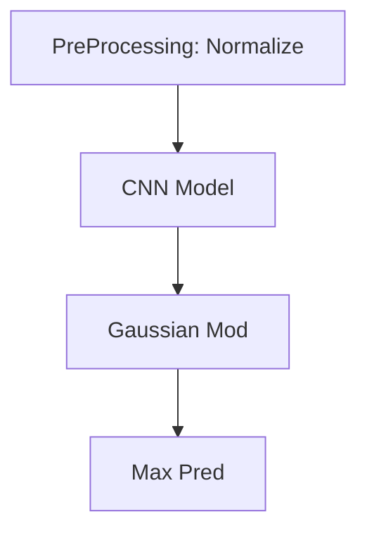

# Accel-Video-Pipe
AV Pipe :-)

## Todo

- [x] Preprocessing

- [ ] DNN Deployment
    - [x] LibTorch
    - [x] OpenVINO
    - [x] TVM
    
    | Engine   | Time/ms, BS=2 |
    | -------- | ------------- |
    | LibTorch | 320           |
    | OpenVINO | 150           |
    | TVM      | 600           |
    | ONNX RT  | 300           |
    
- [ ] Pipelined Processing
    - [ ] Multi-threading
    - [ ] IPC method
    
- [x] Post Processing

