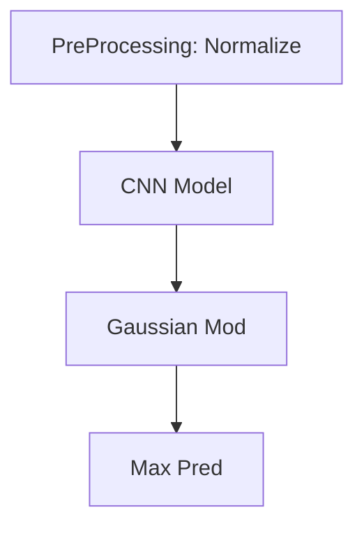

# Accel-Video-Pipe
AV Pipe :-)

## Todo

- [x] Preprocessing
- [ ] DNN Deployment
    - [x] LibTorch
        Timing Results (ms)
            PreProcessing:  4
            NN Processing:  384
            PostProcessing: 7
            Visualizing:    0
    - [ ] OpenVINO
    - [ ] TVM
- [ ] Pipelined Processing
    - [ ] Multi-threading
    - [ ] IPC method
- [x] Post Processing

