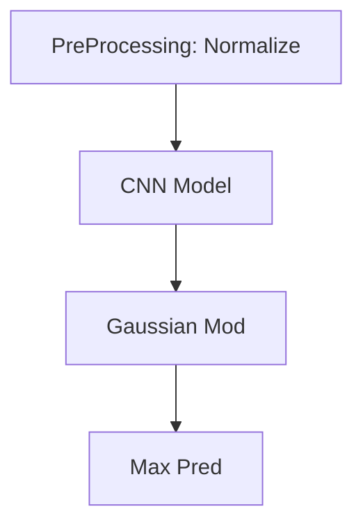

# Accel-Video-Pipe
AV Pipe :-)

## Todo

- [x] Preprocessing

- [ ] DNN Deployment
    - [x] LibTorch
    - [x] OpenVINO
    - [ ] TVM (Not well supported)
    
    CPU: Intel(R) Core(TM) i7-6650U CPU @ 2.20GHz
    GPU: Intel(R) Iris(R) Graphics 540

    | Engine        | Time/ms, BS=2 |
    | ----------    | ------------- |
    | LibTorch      | 500           |
    | OpenVINO CPU  | 150           |
    | OpenVINO GPU  | 170           |
    | ONNX RT       | -             |
    
- [ ] Pipelined Processing
    - [ ] Multi-threading
    - [ ] IPC method
    
- [x] Post Processing

