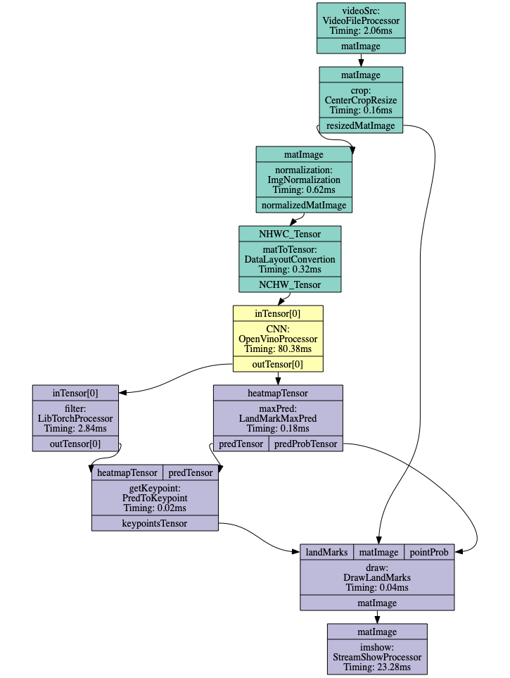

# Accel-Video Pipe

Accel-Video Pipe (AV-Pipe or AVP) is an integrated C++ library for AI video inference tasks on customers' devices, aiming to provide easily-used and high-performance experience for users.

**Note**: as the main work of my independent undergrad thesis, this project is still under development. Feel free to play with AV-Pipe and post any question or suggestion👏. 

## Key Features

**AVP Framework**:

* Modeling the AI video inference task as a continuously running DAG graph, each DAG node can be treated as a modularized component with certain generalizability.

* Rich support for neural network inference, including:

  * LibTorch (Caffe2)
  * OpenVINO (Intel® CPU, GPU, VPU)
  * ONNXRuntime
  * TensorRT (Nvidia® GPU)
  * TVM (not well supported now)

  Note: mainly focus on ONNX network format. For TensorFlow-Models, plz check the [mediapipe](https://github.com/google/mediapipe/).

* Multi-platform: (Consider iOS/Android in the future...)
  * [x] Linux
  * [x] MacOS
  * [ ] Windows (very soon)

* Simple coding style. You can build a video inference pipeline with less than 50 lines of C++.

**AVP Automation:**

* Automatically code generation by using YAML pipeline configurations. User just need to write [YAML](FORMAT.md) files to configure the pipe components (`PipeProcessor` in AVP) and connect different `PipeProcessor`s. `avp_automation.py` class will handle the YAML files and automatically generate the target C++ code and cmake it.

  Note: a nice front-end UI will bring even better user experience.

* Automatically pipeline optimization. `avp_automation.py` also has `profile` method and `multi-threading` method to first estimate the timing info of each `PipeProcessor` and then do an automatic thread allocation and scheduling.

* Visualization of AVP pipeline. `avp_automation` provides `visualize` method to show the DAG graph of pipeline possibly with timing info and thread info. 

  E.g. AVP pipeline of pose_estimation, different colors represent different threads.

  

  

  

## The Structure of Accel-Video-Pipe

Namespace: `avp`

Base Classes (in `avpipe/base.hpp`):

* `StreamPacket`: to store temporal data to be processed;
  * `mat`: `cv::Mat` type, used for opencv-related operations/computations;
  * `tensor`: `aT::Tensor` type (maybe the most friendly C++ tensor type), used for DNN-related operations.

* `Stream`: a queue of `StreamPacket` with thread-safe, synchronized blocking mechanisms.

* `PipeProcessor`: the actual computing module; 
  * `init`: for initialization
  * `process`: a universal procedure for each computing module:
    * take `StreamPacket` from `inStreams`, prepare the `StreamPacket` for `outStreams`.
  * `run`: a virtual function must be implemented by different modules.
  * `bindStream`: used to bind `Stream` to the `PipeProcessor`. 

## Setup and Play

### Environment

you need to install the following C++ libraries to use the AV-Pipe.

* [LibTorch](https://pytorch.org/): for `aT::Tensor` class.
* [OpenCV](https://opencv.org/)

Optional: (depending on your use case)

* [OpenVINO](https://docs.openvinotoolkit.org/latest/index.html)
* [ONNXRuntime](https://microsoft.github.io/onnxruntime/)
* [TensorRT](https://docs.nvidia.com/deeplearning/sdk/tensorrt-developer-guide/index.html)
* [glog](https://github.com/google/glog): for AVP log.

### Play the demo

Run the python script:

```bash
python avp_automation/run.py --xxx [TODO]
```

## Development Info

Please see [Dev Roadmap](ROADMAP.md).